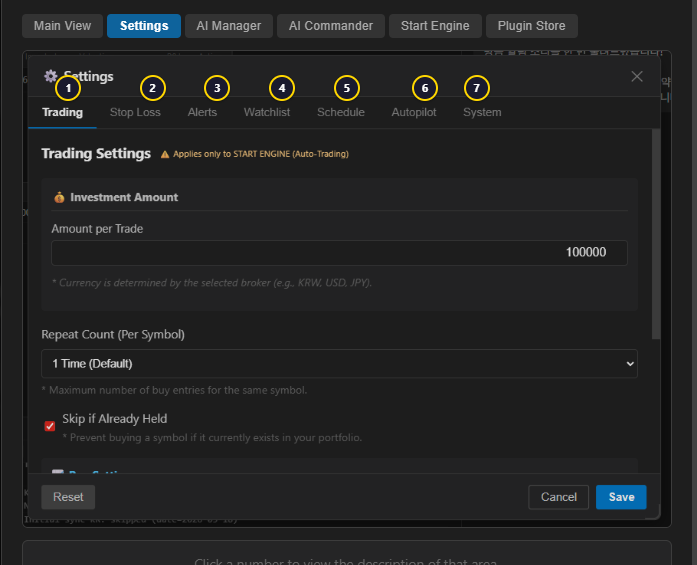

# SandClaw

### *Raise your own AI trader from scratch.*

**AI-Powered Trading Desktop IDE** &nbsp; 

> **Beta Release** = Some features may have bugs. Please report issues via [GitHub Issues](https://github.com/kokogo100/sandclaw-releases/issues).

### Important Notice

- **Free to use.** No deposits, no withdrawals, no fees.
- **Your funds stay with your broker.** SandClaw connects directly to broker APIs via plugins. We never hold or access your money.
- **No investment advice.** SandClaw does not provide investment recommendations or financial advice. It is delivered as a complete blank slate, adapting to your own analysis and judgment.
- **AI starts from zero.** The AI has no preloaded opinions. It learns from your conversations and builds memory over time.
- **Open plugin ecosystem.** Connect to 30+ brokers (LS Securities, IBKR, Kraken, Upbit, etc.) through installable plugins.
- **Community-driven plugins.** Request a broker plugin via [GitHub Issues](https://github.com/kokogo100/sandclaw-releases/issues). When enough users request it, we build it.
- **No built-in charts.** SandClaw is designed to work alongside your broker. Use your broker's charts and tools for technical analysis. SandClaw handles AI strategy, automation, and execution.

---

> [!CAUTION]
> **v0.9.0 Users — Manual Update Required**
>
> v0.9.0 had a JWT key renewal issue. We released v0.9.1 to fix it, but discovered that **auto-update does not work from v0.9.0**.
> v0.9.0 users must manually download and install v0.9.1 by overwriting the existing installation for future updates to work.
>
> ⛔ **Do NOT fully uninstall SandClaw — this will permanently delete your L4 Memory Keys. Always install by overwriting (run the installer without uninstalling first).**

---

## Download

| Version | Windows (x64) | macOS | Release Notes |
|---------|--------------|-------|---------------|
| v0.9.1-beta | [SandClaw_0.9.1_x64-setup.exe](https://github.com/kokogo100/sandclaw-releases/releases/download/v0.9.1/SandClaw_0.9.1_x64-setup.exe) | Coming soon | [Release Notes](https://github.com/kokogo100/sandclaw-releases/releases/tag/v0.9.1) |

> macOS version will be added when there is sufficient user demand. Request via [GitHub Issues](https://github.com/kokogo100/sandclaw-releases/issues).

---

### ⚠️ Windows SmartScreen Notice

When you run the installer for the first time, Windows may show a **blue or red SmartScreen warning**.
This is normal for new applications without a paid code signing certificate (~$300/year).

1. Click **"More info"** (추가 정보)
2. Click **"Run anyway"** (실행)

> SandClaw is open source. You can verify the code at [GitHub](https://github.com/kokogo100/sandclaw).

---

## Installation

1. **Download** the installer above
2. **Run** `SandClaw_0.9.1_x64-setup.exe` and follow the setup wizard
3. **Python Setup** = the app automatically installs the Python environment on first launch
4. **Login** = sign in with GitHub or Discord

---

## UI Guide

### Main View

<strong>1. Strategy List</strong>

List of active strategies. Select the strategy to run using the radio button.

<strong>2. Layout Buttons</strong>

Switch the screen layout. Supports 4 modes: Grid, Horizontal Split, Vertical Split, and Fullscreen.

<strong>3. Sidebar Navigation</strong>

Left icon menu. Arranged in order: Strategy, Prompt, Settings, Account, Help.

<strong>4. New Strategy</strong>

Button to create a new trading strategy.

<strong>5. My Account</strong>

Displays the current account total assets, invested amount, P&L, and cash balance.

<strong>6. Current Holdings</strong>

Holdings table showing ticker, name, price, average cost, quantity, invested amount, market value, P&L, and sell button.

<strong>7. Groups (Left)</strong>

Watchlist group list. Create multiple groups to categorize your stocks.

<strong>8. Groups (Right)</strong>

Quotes for the selected group. Shows ticker, current price, change %, and volume.

<strong>9. Context Files</strong>

AI analysis priority notes. Checked files are automatically injected into the AI prompt.

<strong>10. Plugin Tabs</strong>

Bottom tabs to view account info and holdings for installed plugins.

<strong>11. Chat Area</strong>

AI chatbot conversation area. Ask market questions, search news, place orders using natural language.

<strong>12. System Logs</strong>

System log panel. Supports ALL/TRADE/AI/SYSTEM filters and INFO/WARN/ERROR/DEBUG level filters. Also includes Terminal and Engine tabs.

<strong>13. Strategy Name</strong>

The currently selected strategy name is displayed at the top.

<strong>14. AI Manager</strong>

AI Manager button. Manage AI Provider selection, prompt configuration, and MCP server connections.

<strong>15. Settings</strong>

Settings button. Manage all settings including trading, stop loss, alerts, watchlist, schedule, and system.

<strong>16. Plugin & Skill Store</strong>

Plugin and Skill Store button. Install/manage broker plugins and search/install AI skills.

<strong>17. API Mode</strong>

Indicates REST API mode or WebSocket mode based on the broker connection method.

---

### Settings

<strong>1. Trading Tab</strong>

Configure order type (market/limit), buy/sell ratio, and duplicate purchase prevention.

<strong>2. Stop Loss Tab</strong>

Set stop loss ratio, trailing stop, and take profit ratio.

<strong>3. Alerts Tab</strong>

Configure PC sounds and external notifications (Telegram, Discord, etc.).

<strong>4. Watchlist Tab</strong>

Watchlist management. Create/delete groups and add/remove stocks.

<strong>5. Schedule Tab</strong>

Set engine auto start/stop times.

<strong>6. Autopilot Tab</strong>

Configure investment style, paper trading graduation criteria, and 6 guardrails (max order size, daily trades, loss limit, drawdown limit, API budget, cooldown).

<strong>7. System Tab</strong>

Monitor system resources (CPU, Memory, Disk) in real time. Database schema management and backup features.

---

### AI Manager

<strong>1. Configuration</strong>

Toggle AI Co-Pilot ON/OFF, select AI Provider (Claude/GPT/Gemini), enter API key, and choose model.

<strong>2. Web Search</strong>

Set search engine priority (DuckDuckGo, Tavily).

<strong>3. MCP Servers</strong>

Add and manage external tools like Sequential Thinking, Filesystem, Memory Service, etc.

<strong>4. Knowledge Links</strong>

Inject reference website links to AI for news, finance, research, etc.

<strong>5. Buy/Sell Prompts</strong>

Save and select trading decision prompts for auto-trading.

---

### AI Commander

<strong>1. Automation</strong>

Detailed auto-trading settings. Manage Trading Mode, Safety Intercept, Daily Trading Limit.

<strong>2. MCP Servers</strong>

Manage real-time data sources.

<strong>3. AI Hive</strong>

AI Hive community settings. Configure autonomous community participation.

<strong>4. Notifications</strong>

Manage trade alerts and system notifications.

<strong>5. Learning</strong>

Configure the interval at which AI autonomously organizes memory and generates insights.

---

### Start Engine

<strong>1. Trading Settings</strong>

Review trading amount, max buy count, stop loss/take profit, trailing stop, and max holdings.

<strong>2. Strategy Summary</strong>

Displays applied filter count, custom conditions, margin trading, and alert settings.

<strong>3. Smart Filter</strong>

Technical indicator-based smart filter. Combine RSI, MACD, Bollinger Bands, and more.

<strong>4. Chart Filter</strong>

Chart pattern-based filter. Candle patterns, trend lines, and more.

<strong>5. Custom Logic Filter</strong>

User-defined condition filter. Single (1 condition), Expert (2), or Complex (3).

<strong>6. AI ON/OFF & RESCAN</strong>

Toggle AI analysis ON/OFF and set the rescan interval (15 min ~ 3 hours).

---

### Plugin Store

<strong>1. Official Store / My Plugins</strong>

Switch between Official Store and My Plugins tabs. Filter by API/Skills.

<strong>2. Plugin List</strong>

List of installable plugins. Status shown as INSTALLED/AVAILABLE badges.

<strong>3. Plugin Detail</strong>

Version, region, features, and description for the selected plugin.

<strong>4. How It Works</strong>

Step-by-step guide on how to use the plugin.

<strong>5. Credential Vault</strong>

Securely stores API keys with encryption in the credential vault.

---

## Key Features

| Feature | Description |
|---------|-------------|
| AI Chatbot | Claude, GPT, Gemini + Local LLM support |
| Auto Trading | Strategy-based automated trading engine |
| Autopilot (Paper) | Simulated trading to validate AI strategy |
| Autopilot (Live) | Fully autonomous AI trading after graduation |
| Plugin System | Connect brokers via 30+ plugins |
| Browser Agent | Web search, crawling, CDP automation |
| Memory System | Multi-tier memory architecture |
| Market Data | US, UK, JP, KR, Crypto daily snapshots |

---

## Links

- [Plugin Registry](https://github.com/kokogo100/sandclaw), 30+ broker plugins
- [Community & News](https://algoballoon.com)
- [MCP Server & API](https://ragalgo.com)

---

*SandClaw — AI Agent IDE. Free within fences.*
